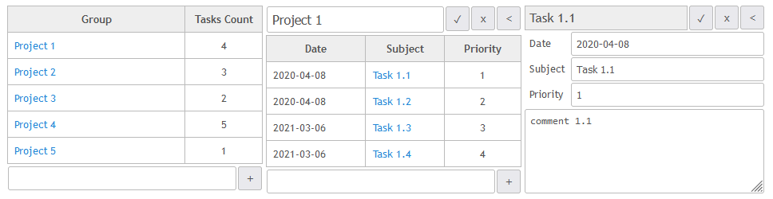
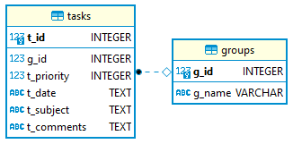

# sdm_demo_todolist_sqlite3_django
Quick Demo of how to use [SQL DAL Maker](https://github.com/panedrone/sqldalmaker) + Python + Django.

Front-end is written in Vue.js, SQLite3 is used as database.





dto.xml
```xml
<dto-class name="dj-Group" ref="groups"/>

<dto-class name="dj-GroupLI" ref="get_groups.sql" pk="g_id"/>

<dto-class name="dj-Task" ref="tasks"/>

<dto-class name="dj-TaskLI" ref="tasks">
    <header><![CDATA[
    # Task list item. No g_id, no t_comments in the list.
    # (No Django conflicts with dj-Task).]]></header>
    <field column="t_comments" type="-"/>
</dto-class>
```
GroupsDao.xml
```xml
<crud dto="dj-Group" table="groups"/>
<query-dto-list dto="dj-GroupLI" method="get_groups"/>
```
TasksDao.xml
```xml
<crud dto="dj-Task" table="tasks"/>
```
Generated code in action:
```go
class GroupListView(APIView):
    @staticmethod
    def get(_):
        groups = dao_g.get_all_groups()
        sz = GroupLISerializer(groups, many=True)
        return Response(sz.data)
    
    @staticmethod
    def post(request):
        sz = GroupEditSerializer(data=request.data)
        sz.is_valid(raise_exception=True)
        dao_g.create_group(sz)
        return HttpResponse(status=status.HTTP_201_CREATED)


class GroupView(APIView):
    @staticmethod
    def get(_, g_id):
        gr = dao_g.read_group(g_id)
        sz = GroupSerializer(gr, many=False)
        return Response(sz.data)
    
    @staticmethod
    def put(request, g_id):
        sz = GroupEditSerializer(data=request.data, partial=True)
        sz.is_valid(raise_exception=True)
        dao_g.rename(g_id, sz.data['g_name'])
        return HttpResponse(status=status.HTTP_200_OK)
    
    @staticmethod
    def delete(_, g_id):
        _ds.delete_by_filter(Task, {'g_id': g_id})
        dao_g.delete_group(g_id)
        return HttpResponse(status=status.HTTP_204_NO_CONTENT)
```